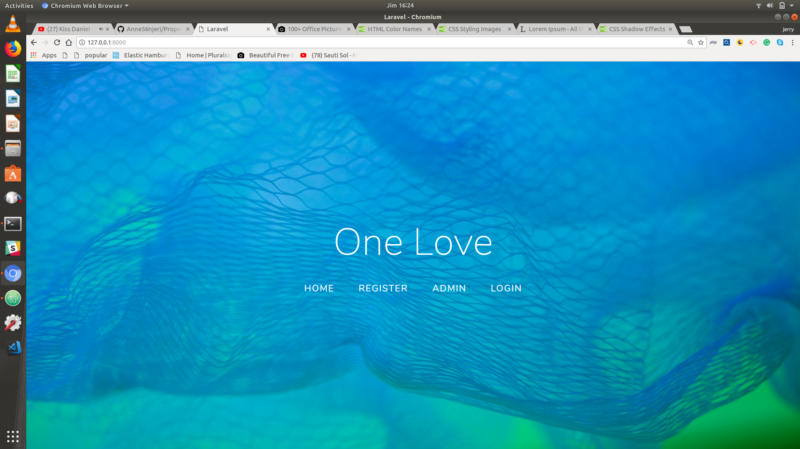
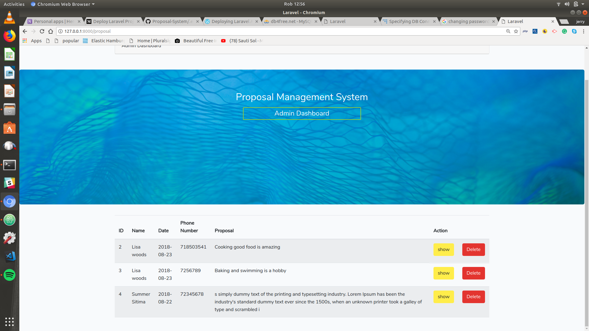
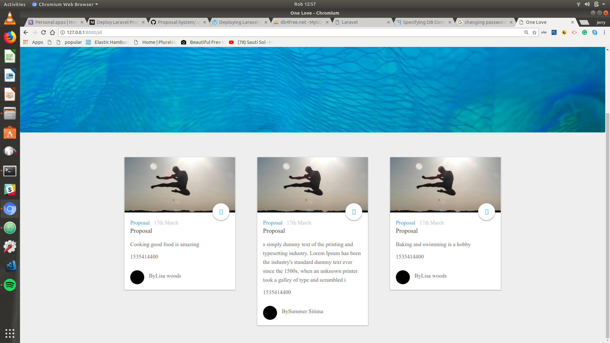

## Proposal Management System
An app built using Laravel5.6  a Php framework  

- Home page

- Admin panel

- All accepted proposal

## Author name
Maryanne  Njeri

## Project Description

- Proposal Management System thats  helps them manage their proposal review process. They need a system that will allow applicants to get a link in their emails to allow them access. Once in a user should be able to create a proposal, save it as draft then when ready submit it for review.

- They also need an admin panel where they can view a list of proposals sent, click on one to review it, if they like it move it on to stage-1 otherwise mark it as rejected. Proposals in stage-1 are then reviewed and moved to stage-2 or rejected. Finally from stage-2 the proposal can either be accepted or rejected.

-  The applicants should automatically be notified via email when their proposal is rejected or accepted. The admin should also see a notification on the system when a new proposal is sent.

## Project setup instructions:

- cd into /var/www/html  
- cd into empty folder
- git clone
- connect to database

## Technology used:
- Php 7.2
- Larave 5.6
- Bootstrap 4
- HTML5/CSS
- Mysql

## Copyright and License information:
Her  project is licenced under the MIT License.

Permission is hereby granted, free of charge, to any person obtaining a copy of this software and associated documentation files (the "Software"), to deal in the Software without restriction, including without limitation the rights to use, copy, modify, merge, publish, distribute, sublicense, and/or sell copies of the Software, and to permit persons to whom the Software is furnished to do so, subject to the following conditions:

The above copyright notice and this permission notice shall be included in all copies or substantial portions of the Software.

THE SOFTWARE IS PROVIDED "AS IS", WITHOUT WARRANTY OF ANY KIND, EXPRESS OR IMPLIED, INCLUDING BUT NOT LIMITED TO THE WARRANTIES OF MERCHANTABILITY, FITNESS FOR A PARTICULAR PURPOSE AND NONINFRINGEMENT. IN NO EVENT SHALL THE AUTHORS OR COPYRIGHT HOLDERS BE LIABLE FOR ANY CLAIM, DAMAGES OR OTHER LIABILITY, WHETHER IN AN ACTION OF CONTRACT, TORT OR OTHERWISE, ARISING FROM, OUT OF OR IN CONNECTION WITH THE SOFTWARE OR THE USE OR OTHER DEALINGS IN THE SOFTWARE.* CopyRight(c) 2017 MaryAnneNjeri
